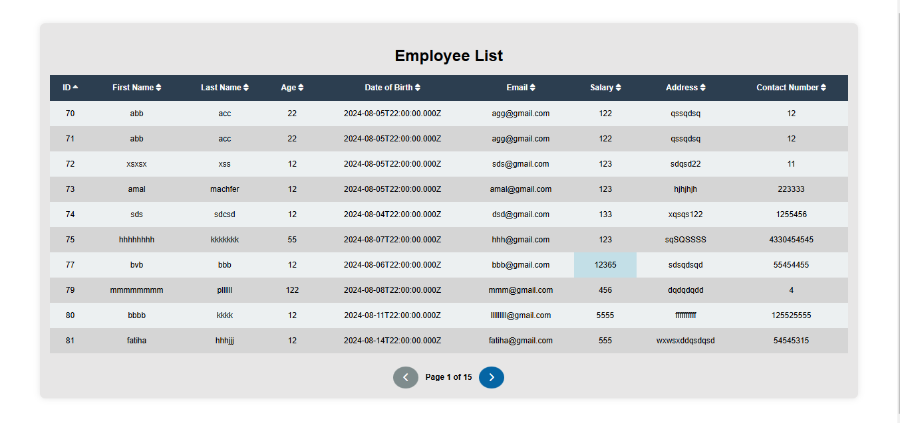

# EmployeeTable

An Angular application to display and manage a list of employees fetched from a remote API.

This project was generated with [Angular CLI](https://github.com/angular/angular-cli) version **18.1.3**.

## Project Overview

**EmployeeTable** fetches employee data from a remote API and displays it in a clean, interactive table with pagination, sorting, and responsive design. It is designed for simplicity and usability across devices.

**API URL:** [https://retoolapi.dev/HYd96h/data](https://retoolapi.dev/HYd96h/data)

## Features

- **Employee List Table**: Shows all employee data in a structured table format
- **Pagination**: Displays 10 items per page for easier navigation
- **Sorting**: Allows sorting by any column for better data management
- **Responsive Design**: Optimized layout for desktop, tablet, and mobile screens

## Screenshot

A preview of the application:

<p align="center">
  
</p>

## Getting Started

### Prerequisites

Make sure you have the following installed:

- **Node.js** v20.11.0
- **npm** v10.2.4
- **Angular CLI** v18.1.3

### Running the Development Server

1. Clone the repository:
   ```bash
   git clone <repository-url>
   ```

2. Navigate to the project directory:
   ```bash
   cd EmployeeTable
   ```

3. Install dependencies:
   ```bash
   npm install
   ```

4. Start the development server:
   ```bash
   ng serve
   ```

5. Open your browser at [http://localhost:4200](http://localhost:4200). The app will reload automatically if you make changes to the source files.

## Technologies Used

- Angular 18
- HTML5 & CSS3
- TypeScript
- REST API integration
